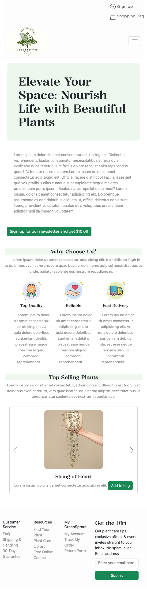

# Green Sprout - Elevate Your Space: Nourish Life with Beautiful Plants

## Description

Welcome to greenSprout, your one-stop destination for buying beautiful plants directly from our greenhouse. Explore a variety of plants, learn about plant care, and soon, enjoy the feature to trade and swap your plants with fellow enthusiasts.

This project includes HTML, CSS and Bootstrap (Bootstrap is automatically fetched at [index.html](https://github.com/yhuuuu/Per-Scholas/blob/26081b85ca2fb585b793e7ec635c71ccedea5a3e/GreenSprout/index.html#L9C1-L13C42)).

## Features

- **Plant Shopping:** Browse and purchase a diverse selection of plants from our greenhouse.
  
- **Direct Shipping:** Enjoy the convenience of having your chosen plants shipped directly to your door.

- **Plant Care Guide:** Learn valuable tips and information about plant care to keep your green companions thriving.

- **Future Feature: Plant Trading:** Soon, you'll be able to trade and swap plants with other enthusiasts.


### How to Use

Follow these steps to set up greenSprout locally:

```bash
# Clone the greenSprout repository
git clone git@github.com:yhuuuu/Per-Scholas.git

# Go to GreenSprout folder
cd Per-Scholas/GreenSprout/

# Open index.html file
open index.html

```

## Screenshots

### Desktop View

### Mobile View


## Authors

Yuting Hu  


## Acknowledgments

Inspiration, code snippets, etc.
* [ReadMe-Template](https://gist.github.com/DomPizzie/7a5ff55ffa9081f2de27c315f5018afc)
* [Bootstrap 5 Card Carousel | Multiple items carousel](https://www.youtube.com/watch?v=kHPm_AlxP7U)
* [Plant Images](https://unsplash.com/@feeypflanzen)
* [Icons](https://www.flaticon.com/)
* [Bootstrap](https://getbootstrap.com/)

