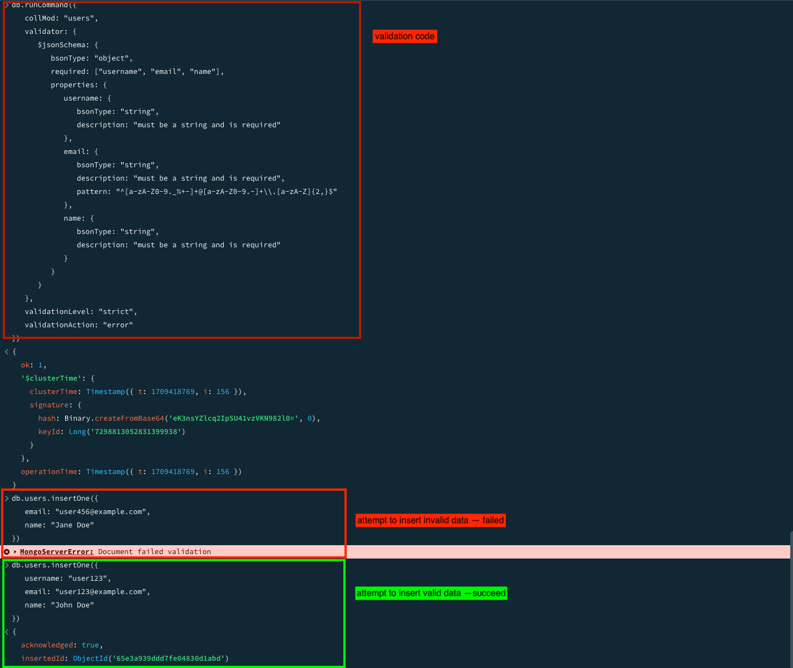
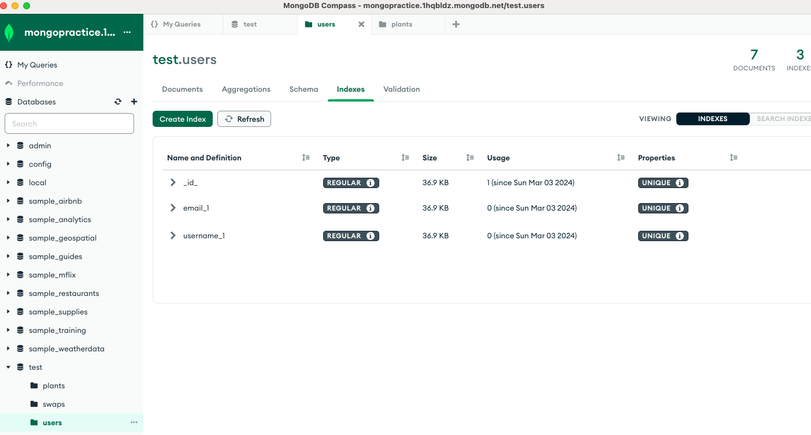
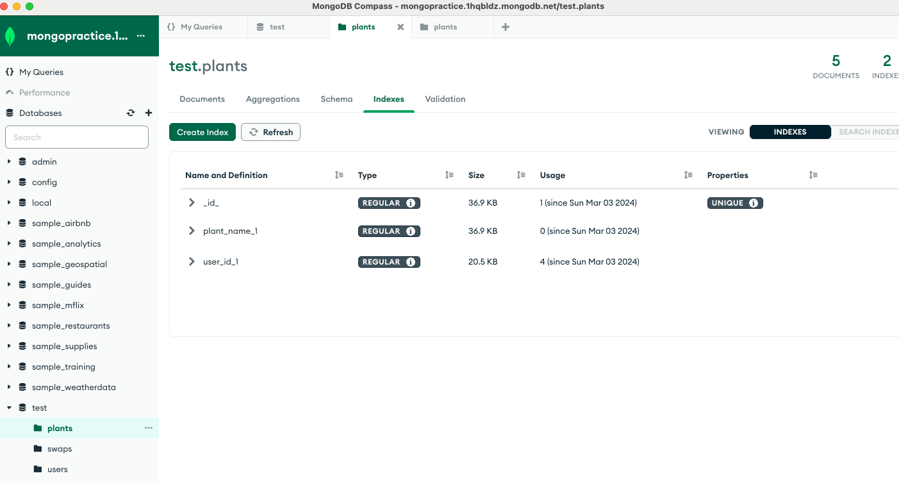
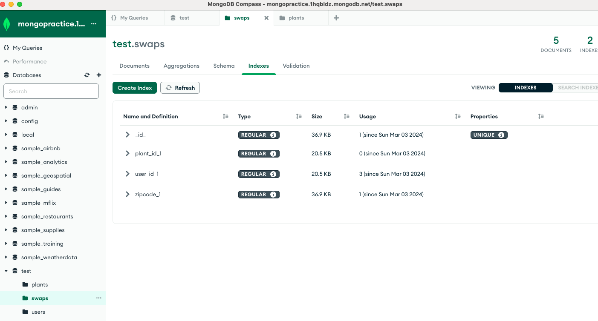

# SBA 319 MongoDB Database Application (Mongoose)

## Table of Contents
  - [Table of Contents](#table-of-contents)
  - [Introduction](#introduction)
  - [Features](#features)
  - [Technologies](#technologies-used)
  - [Installation](#installation)
  - [Usage](#usage)
  - [Endpoints](#endpoints)
  - [Dependencies](#dependencies)


## Introduction

This project implements a CRUD API using Node.js, Express, and MongoDB, along with Mongoose for data modeling and validation. The API will serve as a backend service for managing resources like users, plant information, and swap information.The API allows users to perform Create, Read, Update, and Delete operations on resources stored in a MongoDB database. Express middleware will be implemented to handle tasks such as request parsing, logging, and error handling.

## Features

CRUD Operations: Implement Create, Read, Update, and Delete operations for managing resources in the MongoDB database.
MongoDB Indexes: Utilize MongoDB indexing to optimize query performance and enhance data retrieval efficiency.
MongoDB Validation: Define validation rules using Mongoose to ensure data consistency and integrity within the database.

## Technologies Used

* Nodes.js: A JavaScript runtime environment that executes JavaScript code outside a web browser.
* Express.js :A minimalist web application framework for Node.js used to build robust APIs and web applications.
* MongoDB: A NoSQL database that stores data in flexible, JSON-like documents.
* Mongoose: An Object Data Modeling (ODM) library for MongoDB and Node.js that provides a schema-based solution for modeling application data.

## Installation

1. Clone the repository: git clone <https://github.com/yhuuuu/Per-Scholas.git>

2. Navigate to the project directory: cd <SBA_319_MongoDB>

3. Install dependencies: npm install

4. Set up environment variables:
    ```
    PORT=<port-number>
    MONGODB_URI=<mongodb-connection-uri>
    ```
5. Sedding the data by uncommenting the see route code and navigating to the seed route
    1. Uncommeent the Seed Route
    ```
    // Uncomment the seed route
    app.get('/seed', async (req, res) => {
    // Seed your database with sample data here
    });
    ```
    2. Navigate the Seed Route
    ```
    http://localhost:3000/seed
    ```
    3. Seed the Data
    4. Verify data in MongoDB


## Usage

* Use an API client like Postman(or ThunderClient vis Vscode) or curl to interact with the CRUD API endpoints.
* Refer to the API documentation for details on available endpoints and request/response formats.


## Endpoints
* GET /users: Retrieve all users.
* POST /users: Create a new user.
* PATCH /users/:user_id: Update a specific user by ID.
* DELETE /users/:user_id: Delete a specific user by ID.
* GET /users/:id: Retrieve a specific user by ID.
* GET /users/:id/plants Retrieve plant information by user ID.
* GET /users/:id/swaps Retrieve swapts information by user ID.
* GET /users/:user_id/info: Retrieve plant information and swap informationfor a specific user.


* GET /plants: Retrieve all plant information.
* GET /plants/users/user_id: Retrieve all plant information by user ID.

* GET /swaps: Retrieve all swap information.
* GET /swaps/user/:user_id: Retrieve all swap information by user ID.
* GET /swaps/zipcode/:zipcode: Retrieve all swap information by zipcode


## Validation

 
## Indexs





## Dependencies
* dotenv: 16.4.5
* express: 4.18.2
* mongoose: 8.2.0