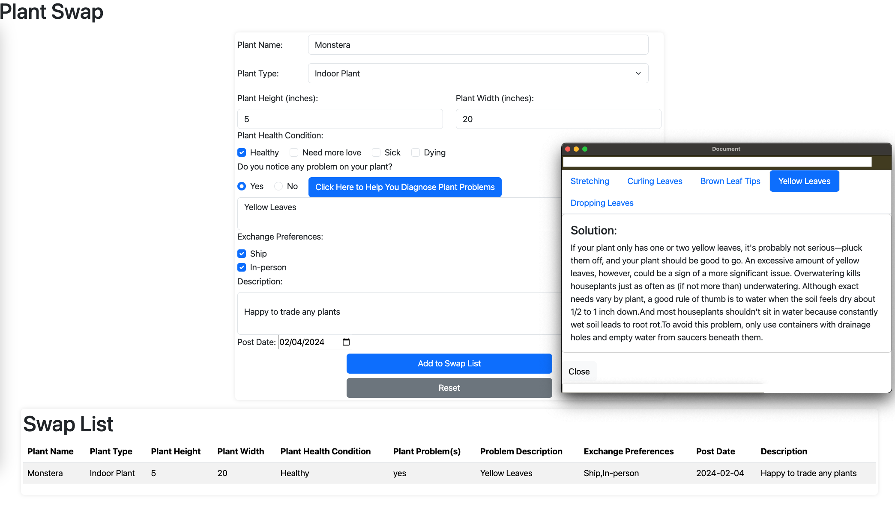

# The Document Object Model: The Plant Swap Website

## Description

This assessment evaluates comprehension of the Document Object Model (DOM) and ability to apply its features in a practical way. The purpose of this website is to provide a platform for users to submit information about plants that they wish to swap. The website also includes a pop-up feature that provides users with information to diagnose plant problems while they are filling out the submission form.

This project includes HTML, CSS , JavaScript and Bootstrap (Bootstrap is automatically fetched at [index.html](https://github.com/yhuuuu/Per-Scholas/blob/35f84190b93a3dea8465d79d61a24cd57f7c8d58/The%20Document%20Object%20Model/index.html#L9C1-L13C41) and [problem.html](https://github.com/yhuuuu/Per-Scholas/blob/35f84190b93a3dea8465d79d61a24cd57f7c8d58/The%20Document%20Object%20Model/problem.html#L8C1-L12C42)) 


## Features

- **Easy to Submit:** Simple to entry the information and click submit button.

- **Easy to Reset Form:** Reset button.

- **Pop Up Plant Problem Window:** Easy to diagnose plant problems while filling out the submission form. Comment box only show up when user select "Yes".


### How to Use

Follow these steps to set up SwapPlant locally:

```bash
# Clone the greenSprout repository
git clone git@github.com:yhuuuu/Per-Scholas/tree/DOM_SBA


# Go to GreenSprout folder
cd Per-Scholas/The Document Object Model/

# Open index.html file
open index.html

```

## Screenshots

### Desktop View



## Authors

Yuting Hu  


## Acknowledgments

Inspiration, code snippets, etc.
* [Pop up window - Top right](https://github.com/MaxArt2501/share-this/issues/17)


